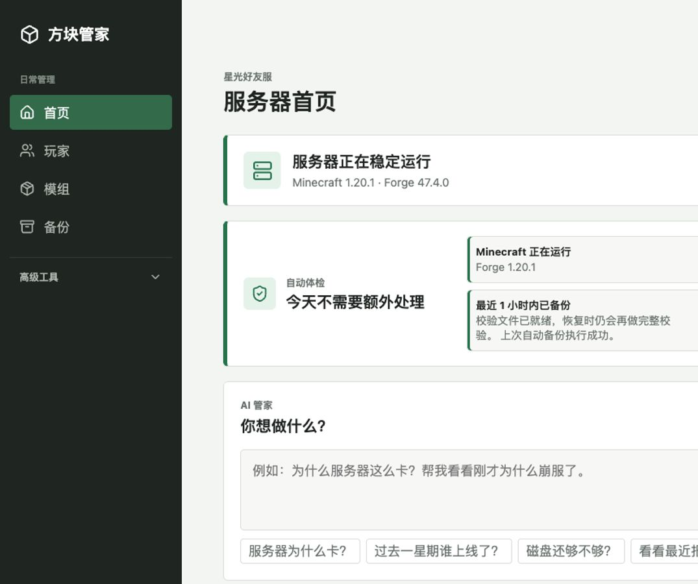

# 方块管家 AI MC Panel

[](https://github.com/aidong27/ai-mc-panel/actions/workflows/ci.yml)
[](LICENSE)
[](apps/api/pyproject.toml)
[](apps/web/package.json)

一个面向 Minecraft 好友服的 AI 原生、安全优先管理面板。用户描述想做什么，AI 只能调用受约束工具；中高风险操作必须经过确认，模型永远拿不到任意 Shell。

> 当前版本：`0.4.2-alpha`。项目已经在单机大型模组服上运行，但公开安装流程仍要求管理员完成只读审计。请不要把未经核对的生产服务器当作测试环境。



[English](README.en.md) | [架构](ARCHITECTURE.md) | [安全模型](SECURITY.md) | [部署](DEPLOYMENT.md) | [贡献指南](CONTRIBUTING.md)

## 为什么做它

传统服务器面板把 Linux、Java、模组、端口和配置文件直接交给用户。方块管家把这些细节收进适配层，首页只回答几个普通问题：服务器是否正常、谁在线、机器够不够用，以及“你想做什么”。

产品原则：用户负责玩 Minecraft，剩下的交给 AI。

## 已实现

- 登录、Argon2id 密码、可撤销 Session、CSRF 与 WebSocket 一次性票据。
- 服务状态、CPU、内存、磁盘、TPS、玩家、日志和崩溃报告。
- Forge、NeoForge、Fabric、Quilt 与 Vanilla 的日志/文件结构识别。
- 玩家活跃持久化，只保存玩家名和登录时间，不保存 IP 或原始日志行。
- 模组元数据、重复项提示、白名单、OP 和安全字段配置。
- 手动/定时备份、可失效的完整校验凭据、恢复前保护点和失败回滚。
- OpenAI 兼容 AI 接口、调用限额、日志压缩、脱敏和受约束工具。
- AI 工具显式区分只读、可提议和仅手动；通用控制台默认关闭且不进入模型 schema。
- 中风险一次确认、高风险二次确认、精确参数 review、服务器 fingerprint 与完整审计日志。
- 简体中文、移动端、亮色/深色模式。

## 安全边界

```text
Browser
  -> FastAPI (低权限 mc-panel 用户)
       -> 只读适配器
       -> AI 工具注册表
       -> 风险确认状态机
       -> sudo /usr/local/libexec/mc-panel-action
            -> root 所有的 helper.json
            -> 固定 systemd、screen、目录和备份命令
```

- AI 文本不会作为命令执行。
- helper 不接受 Shell、任意路径、任意 URL 或命令行参数。
- helper 运行配置必须为 `root:root` 且不可被组/其他用户写入。
- API 默认只监听 `127.0.0.1`，公网入口必须使用 HTTPS 反向代理。
- 面板停止或损坏不会停止 Minecraft。

完整威胁模型见 [SECURITY.md](SECURITY.md)。

## 本地体验

本地默认使用 mock adapter，不会连接真实 Minecraft 服务器。

```bash
cp .env.example .env
set -a
source .env
set +a

uv sync --project apps/api --all-extras --locked
npm --prefix apps/web ci
npm --prefix apps/web run build

uv run --project apps/api mc-panel-admin create-user admin
uv run --project apps/api mc-panel-api
```

另开终端运行前端开发服务器：

```bash
npm --prefix apps/web run dev
```

浏览器访问 `http://127.0.0.1:5173`。管理员密码由本地 CLI 交互创建，项目没有默认密码。

## 生产接入

当前生产适配器支持一台 Linux systemd 主机，控制台通道为现有 `screen` 会话。接入前必须确认：

1. Minecraft 根目录、启动文件、服务 unit、端口与运行账号。
2. 现有备份目录、归档命名规则、备份命令和 systemd timer。
3. 日志、模组、配置文件和备份的最小只读 ACL。
4. 独立恢复点、回滚方法和服务器 fingerprint。

先执行 [DEPLOYMENT.md](DEPLOYMENT.md) 中的只读 preflight。安装器要求显式提供关键路径，不会自动开放公网端口，也不会修改 Minecraft、Java、模组、世界、防火墙或 SSH。

## 项目结构

```text
apps/api/          FastAPI、认证、SQLite、适配器和 AI 编排
apps/web/          React + TypeScript 中文界面
helper/            root 所有的固定特权操作入口
deploy/            systemd、Caddy、HAProxy 和可回滚部署脚本
tests/fixtures/    mock 服务器数据
tests/e2e/         隔离的浏览器验收服务
docs/              截图、路线图和公开项目文档
```

## 开发检查

```bash
cd apps/api
.venv/bin/ruff format --check src tests ../../helper ../../deploy/scripts ../../tests/e2e
.venv/bin/ruff check src tests ../../helper ../../deploy/scripts ../../tests/e2e
.venv/bin/mypy src
.venv/bin/pytest

cd ../web
npm test
npm run build
npx playwright install chromium
npm run test:e2e
npm audit --omit=dev
```

详细矩阵见 [TESTING.md](TESTING.md)。安全问题请按 [SECURITY.md](SECURITY.md#漏洞报告) 私下报告，不要先创建公开 Issue。

## 当前限制

- 单节点、单 Minecraft 服务，不支持多租户和商业计费。
- 首个写适配器要求 systemd、screen 和外部一致性备份命令。
- 不提供删除世界、自动升级 Minecraft/Java/整合包或修改防火墙的工具。
- 恢复流程有隔离测试，不在真实世界上进行破坏性演练。
- 操作结果保证等级、幂等键和 helper receipt 尚未完成，未知结果窗口仍在后续路线图中。
- Passkey、外部告警和更多控制台适配器仍在路线图中。

## License

Apache License 2.0。详见 [LICENSE](LICENSE)。
